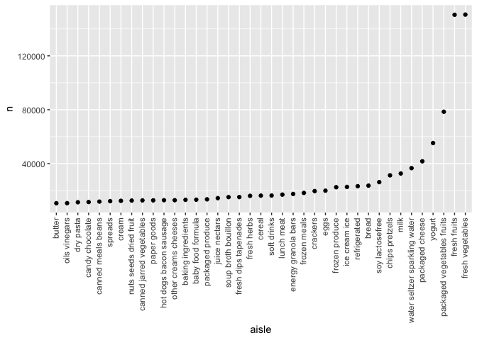
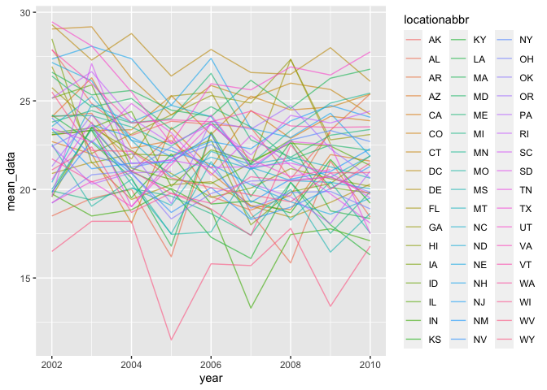

Homework 3
================
Yuan Meng
2021-10-18

## Problem1

``` r
aisle_df = 
  instacart %>%
  count(aisle) %>%     
  arrange(desc(n))
nrow(aisle_df) #number of aisles
```

    ## [1] 134

``` r
head(aisle_df, n =1) #the aisle of the most items ordered from is the last row of the data frame
```

    ## # A tibble: 1 × 2
    ##   aisle                 n
    ##   <chr>             <int>
    ## 1 fresh vegetables 150609

From the aisle\_df there are 134 aisles and fresh vegatables is the most
order from. The order number is 150609.

``` r
aisle_plot =
  aisle_df %>%
  filter(n > 10000) %>%#limiting to aisles with more than 10000 items ordered
  mutate(aisle = factor(aisle), aisle = fct_reorder(aisle, n))
ggplot(aisle_plot,aes(x = aisle, y = n)) + 
geom_point() + theme(axis.text.x = element_text(angle = 90, vjust = 0.4, hjust = 1)) #plot number of items ordered in each aisle
```

<!-- -->

``` r
popular_item_df = 
  instacart %>%
  filter(aisle %in% c("baking ingredients", "dog food care","packaged vegetables fruits")) %>%                       #filter out required aisles
  group_by(aisle) %>%     
  count(product_name) %>%  #count the number of times each item is ordered 
  mutate(rank = min_rank(desc(n))) %>% #rank the popular items
  filter(rank < 4) %>% #showing the three most popular items
  arrange(aisle, rank) #showing the three most popular items in each of the aisles in rank order
popular_item_df
```

    ## # A tibble: 9 × 4
    ## # Groups:   aisle [3]
    ##   aisle                      product_name                                n  rank
    ##   <chr>                      <chr>                                   <int> <int>
    ## 1 baking ingredients         Light Brown Sugar                         499     1
    ## 2 baking ingredients         Pure Baking Soda                          387     2
    ## 3 baking ingredients         Cane Sugar                                336     3
    ## 4 dog food care              Snack Sticks Chicken & Rice Recipe Dog…    30     1
    ## 5 dog food care              Organix Chicken & Brown Rice Recipe        28     2
    ## 6 dog food care              Small Dog Biscuits                         26     3
    ## 7 packaged vegetables fruits Organic Baby Spinach                     9784     1
    ## 8 packaged vegetables fruits Organic Raspberries                      5546     2
    ## 9 packaged vegetables fruits Organic Blueberries                      4966     3

``` r
mean_hour_df = 
  instacart %>%
  filter(product_name %in% c("Pink Lady Apples","Coffee Ice Cream")) %>% #filter out specific product name
  group_by(product_name, order_dow) %>% 
  summarize(mean_hour = mean(order_hour_of_day)) %>%  #calculate mean hour of the day 
  pivot_wider(names_from = order_dow, values_from = mean_hour) %>%  #format this table for 2*7
  rename(Sunday = "0",Monday = "1",Tuesday = "2",Wednesday = "3",Thursday = "4",Friday = "5",Saturday = "6" ) #rename the column to make the table clear
mean_hour_df
```

    ## # A tibble: 2 × 8
    ## # Groups:   product_name [2]
    ##   product_name     Sunday Monday Tuesday Wednesday Thursday Friday Saturday
    ##   <chr>             <dbl>  <dbl>   <dbl>     <dbl>    <dbl>  <dbl>    <dbl>
    ## 1 Coffee Ice Cream   13.8   14.3    15.4      15.3     15.2   12.3     13.8
    ## 2 Pink Lady Apples   13.4   11.4    11.7      14.2     11.6   12.8     11.9

## Problem2

``` r
library(p8105.datasets)
data("brfss_smart2010")
```

``` r
brfss_df = 
  brfss_smart2010 %>%
  janitor::clean_names() %>% #format the data to use appropriate variable names;
  mutate(topic = "Overall Health") %>% #focus on the “Overall Health” topic
  filter(response %in% c("Excellent","Very good","Good","Fair", "Poor")) %>%  #include only responses from “Excellent” to “Poor”
  mutate(
    response = forcats::fct_relevel(response, c("Excellent","Very good","Good","Fair", "Poor"))) %>% 
  arrange(desc(response)) #organize responses as a factor taking levels ordered from “Poor” to “Excellent”
brfss_df
```

    ## # A tibble: 10,625 × 23
    ##     year locationabbr locationdesc  class  topic  question  response sample_size
    ##    <int> <chr>        <chr>         <chr>  <chr>  <chr>     <fct>          <int>
    ##  1  2010 AL           AL - Jeffers… Healt… Overa… How is y… Poor              45
    ##  2  2010 AL           AL - Mobile … Healt… Overa… How is y… Poor              66
    ##  3  2010 AL           AL - Tuscalo… Healt… Overa… How is y… Poor              35
    ##  4  2010 AZ           AZ - Maricop… Healt… Overa… How is y… Poor              62
    ##  5  2010 AZ           AZ - Pima Co… Healt… Overa… How is y… Poor              49
    ##  6  2010 AZ           AZ - Pinal C… Healt… Overa… How is y… Poor              30
    ##  7  2010 AR           AR - Benton … Healt… Overa… How is y… Poor              21
    ##  8  2010 AR           AR - Pulaski… Healt… Overa… How is y… Poor              36
    ##  9  2010 AR           AR - Washing… Healt… Overa… How is y… Poor              16
    ## 10  2010 CA           CA - Alameda… Healt… Overa… How is y… Poor              23
    ## # … with 10,615 more rows, and 15 more variables: data_value <dbl>,
    ## #   confidence_limit_low <dbl>, confidence_limit_high <dbl>,
    ## #   display_order <int>, data_value_unit <chr>, data_value_type <chr>,
    ## #   data_value_footnote_symbol <chr>, data_value_footnote <chr>,
    ## #   data_source <chr>, class_id <chr>, topic_id <chr>, location_id <chr>,
    ## #   question_id <chr>, respid <chr>, geo_location <chr>

``` r
year02_df = 
  brfss_df %>%
  filter(year == 2002) %>%
  group_by(locationabbr) %>%
  summarize(num_02 = n_distinct(locationdesc)) %>%
 filter(num_02 >= 7 ) #states were observed at 7 or more locations in 2002
year02_df
```

    ## # A tibble: 6 × 2
    ##   locationabbr num_02
    ##   <chr>         <int>
    ## 1 CT                7
    ## 2 FL                7
    ## 3 MA                8
    ## 4 NC                7
    ## 5 NJ                8
    ## 6 PA               10

``` r
year10_df = 
  brfss_df %>%
  filter(year == 2010)  %>%
 group_by(locationabbr) %>%
  summarize(num_10 = n_distinct(locationdesc))%>%
 filter(num_10 >= 7 ) #states were observed at 7 or more locations in 2010
year10_df
```

    ## # A tibble: 14 × 2
    ##    locationabbr num_10
    ##    <chr>         <int>
    ##  1 CA               12
    ##  2 CO                7
    ##  3 FL               41
    ##  4 MA                9
    ##  5 MD               12
    ##  6 NC               12
    ##  7 NE               10
    ##  8 NJ               19
    ##  9 NY                9
    ## 10 OH                8
    ## 11 PA                7
    ## 12 SC                7
    ## 13 TX               16
    ## 14 WA               10

In 2002, state CT, FL, MA, NC,NJ, PA were observed at 7 or more
locations. In 2010, state CA, CO, FL, MA, MD, NC, NE, NJ, NY, OH, PA,
SC, TX, WA were observed at 7 or more locations.

``` r
excellent_df = 
  brfss_df %>%
  filter(response == 'Excellent') %>% #dataset that is limited to Excellent responses
  group_by(locationabbr, year) %>%
  summarize(mean_data = mean(data_value)) #averages the data_value across locations within a state.
excellent_df  
```

    ## # A tibble: 443 × 3
    ## # Groups:   locationabbr [51]
    ##    locationabbr  year mean_data
    ##    <chr>        <int>     <dbl>
    ##  1 AK            2002      27.9
    ##  2 AK            2003      24.8
    ##  3 AK            2004      23.0
    ##  4 AK            2005      23.8
    ##  5 AK            2007      23.5
    ##  6 AK            2008      20.6
    ##  7 AK            2009      23.2
    ##  8 AL            2002      18.5
    ##  9 AL            2003      19.5
    ## 10 AL            2004      20  
    ## # … with 433 more rows

``` r
ggplot(excellent_df,aes(x = year, y = mean_data, group= locationabbr, color = locationabbr)) + geom_line(alpha = 0.6) #“spaghetti” plot of this average value over time within a state
```

    ## Warning: Removed 3 row(s) containing missing values (geom_path).

<!-- -->
