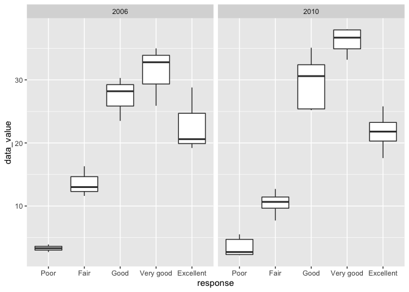
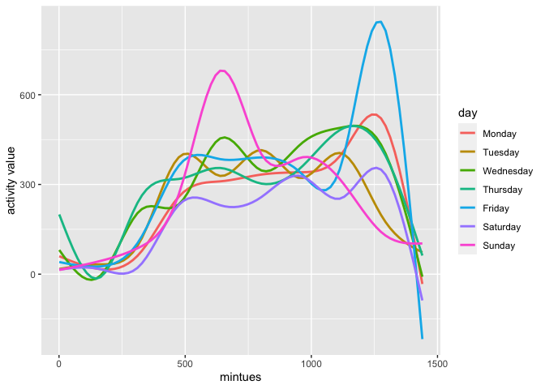

Homework 3
================
Yuan Meng
2021-10-18

## Problem 1

``` r
aisle_df = 
  instacart %>%
  count(aisle) %>%     
  arrange(desc(n))
nrow(aisle_df) #number of aisles
```

    ## [1] 134

``` r
head(aisle_df, n =1) #the aisle of the most items ordered from is the last row of the data frame
```

    ## # A tibble: 1 × 2
    ##   aisle                 n
    ##   <chr>             <int>
    ## 1 fresh vegetables 150609

From the aisle\_df there are 134 aisles and fresh vegetables is the most
order from. The order number is 150609.

``` r
aisle_plot =
  aisle_df %>%
  filter(n > 10000) %>%#limiting to aisles with more than 10000 items ordered
  mutate(aisle = factor(aisle), aisle = fct_reorder(aisle, n))
ggplot(aisle_plot,aes(x = aisle, y = n)) + 
geom_point() + theme(axis.text.x = element_text(angle = 90, vjust = 0.4, hjust = 1)) #plot number of items ordered in each aisle
```

<!-- -->

``` r
popular_item_df = 
  instacart %>%
  filter(aisle %in% c("baking ingredients", "dog food care","packaged vegetables fruits")) %>%                       #filter out required aisles
  group_by(aisle) %>%     
  count(product_name) %>%  #count the number of times each item is ordered 
  mutate(rank = min_rank(desc(n))) %>% #rank the popular items
  filter(rank < 4) %>% #showing the three most popular items
  arrange(aisle, rank) #showing the three most popular items in each of the aisles in rank order
popular_item_df
```

    ## # A tibble: 9 × 4
    ## # Groups:   aisle [3]
    ##   aisle                      product_name                                n  rank
    ##   <chr>                      <chr>                                   <int> <int>
    ## 1 baking ingredients         Light Brown Sugar                         499     1
    ## 2 baking ingredients         Pure Baking Soda                          387     2
    ## 3 baking ingredients         Cane Sugar                                336     3
    ## 4 dog food care              Snack Sticks Chicken & Rice Recipe Dog…    30     1
    ## 5 dog food care              Organix Chicken & Brown Rice Recipe        28     2
    ## 6 dog food care              Small Dog Biscuits                         26     3
    ## 7 packaged vegetables fruits Organic Baby Spinach                     9784     1
    ## 8 packaged vegetables fruits Organic Raspberries                      5546     2
    ## 9 packaged vegetables fruits Organic Blueberries                      4966     3

``` r
mean_hour_df = 
  instacart %>%
  filter(product_name %in% c("Pink Lady Apples","Coffee Ice Cream")) %>% #filter out specific product name
  group_by(product_name, order_dow) %>% 
  summarize(mean_hour = mean(order_hour_of_day)) %>%  #calculate mean hour of the day 
  pivot_wider(names_from = order_dow, values_from = mean_hour) %>%  #format this table for 2*7
  rename(Sunday = "0",Monday = "1",Tuesday = "2",Wednesday = "3",Thursday = "4",Friday = "5",Saturday = "6" ) #rename the column to make the table clear
mean_hour_df
```

    ## # A tibble: 2 × 8
    ## # Groups:   product_name [2]
    ##   product_name     Sunday Monday Tuesday Wednesday Thursday Friday Saturday
    ##   <chr>             <dbl>  <dbl>   <dbl>     <dbl>    <dbl>  <dbl>    <dbl>
    ## 1 Coffee Ice Cream   13.8   14.3    15.4      15.3     15.2   12.3     13.8
    ## 2 Pink Lady Apples   13.4   11.4    11.7      14.2     11.6   12.8     11.9

## Problem 2

``` r
library(p8105.datasets)
data("brfss_smart2010")
```

``` r
brfss_df = 
  brfss_smart2010 %>%
  janitor::clean_names() %>% #format the data to use appropriate variable names;
  mutate(topic = "Overall Health") %>% #focus on the “Overall Health” topic
  filter(response %in% c("Excellent","Very good","Good","Fair", "Poor")) %>%  #include only responses from “Excellent” to “Poor”
  mutate(
    response = forcats::fct_relevel(response, c("Excellent","Very good","Good","Fair", "Poor"))) %>% 
  arrange(desc(response)) #organize responses as a factor taking levels ordered from “Poor” to “Excellent”
brfss_df
```

    ## # A tibble: 10,625 × 23
    ##     year locationabbr locationdesc  class  topic  question  response sample_size
    ##    <int> <chr>        <chr>         <chr>  <chr>  <chr>     <fct>          <int>
    ##  1  2010 AL           AL - Jeffers… Healt… Overa… How is y… Poor              45
    ##  2  2010 AL           AL - Mobile … Healt… Overa… How is y… Poor              66
    ##  3  2010 AL           AL - Tuscalo… Healt… Overa… How is y… Poor              35
    ##  4  2010 AZ           AZ - Maricop… Healt… Overa… How is y… Poor              62
    ##  5  2010 AZ           AZ - Pima Co… Healt… Overa… How is y… Poor              49
    ##  6  2010 AZ           AZ - Pinal C… Healt… Overa… How is y… Poor              30
    ##  7  2010 AR           AR - Benton … Healt… Overa… How is y… Poor              21
    ##  8  2010 AR           AR - Pulaski… Healt… Overa… How is y… Poor              36
    ##  9  2010 AR           AR - Washing… Healt… Overa… How is y… Poor              16
    ## 10  2010 CA           CA - Alameda… Healt… Overa… How is y… Poor              23
    ## # … with 10,615 more rows, and 15 more variables: data_value <dbl>,
    ## #   confidence_limit_low <dbl>, confidence_limit_high <dbl>,
    ## #   display_order <int>, data_value_unit <chr>, data_value_type <chr>,
    ## #   data_value_footnote_symbol <chr>, data_value_footnote <chr>,
    ## #   data_source <chr>, class_id <chr>, topic_id <chr>, location_id <chr>,
    ## #   question_id <chr>, respid <chr>, geo_location <chr>

``` r
year02_df = 
  brfss_df %>%
  filter(year == 2002) %>% #in 2002
  group_by(locationabbr) %>%
  summarize(num_02 = n_distinct(locationdesc)) %>%
 filter(num_02 >= 7 ) #states were observed at 7 or more locations in 2002
year02_df
```

    ## # A tibble: 6 × 2
    ##   locationabbr num_02
    ##   <chr>         <int>
    ## 1 CT                7
    ## 2 FL                7
    ## 3 MA                8
    ## 4 NC                7
    ## 5 NJ                8
    ## 6 PA               10

``` r
year10_df = 
  brfss_df %>%
  filter(year == 2010)  %>% #in 2010
 group_by(locationabbr) %>%
  summarize(num_10 = n_distinct(locationdesc))%>%
 filter(num_10 >= 7 ) #states were observed at 7 or more locations in 2010
year10_df
```

    ## # A tibble: 14 × 2
    ##    locationabbr num_10
    ##    <chr>         <int>
    ##  1 CA               12
    ##  2 CO                7
    ##  3 FL               41
    ##  4 MA                9
    ##  5 MD               12
    ##  6 NC               12
    ##  7 NE               10
    ##  8 NJ               19
    ##  9 NY                9
    ## 10 OH                8
    ## 11 PA                7
    ## 12 SC                7
    ## 13 TX               16
    ## 14 WA               10

In 2002, state CT, FL, MA, NC,NJ, PA were observed at 7 or more
locations. In 2010, state CA, CO, FL, MA, MD, NC, NE, NJ, NY, OH, PA,
SC, TX, WA were observed at 7 or more locations.

``` r
excellent_df = 
  brfss_df %>%
  filter(response == 'Excellent') %>% #dataset that is limited to Excellent responses
  group_by(locationabbr, year) %>%
  summarize(mean_data = mean(data_value)) #averages the data_value across locations within a state.
excellent_df  
```

    ## # A tibble: 443 × 3
    ## # Groups:   locationabbr [51]
    ##    locationabbr  year mean_data
    ##    <chr>        <int>     <dbl>
    ##  1 AK            2002      27.9
    ##  2 AK            2003      24.8
    ##  3 AK            2004      23.0
    ##  4 AK            2005      23.8
    ##  5 AK            2007      23.5
    ##  6 AK            2008      20.6
    ##  7 AK            2009      23.2
    ##  8 AL            2002      18.5
    ##  9 AL            2003      19.5
    ## 10 AL            2004      20  
    ## # … with 433 more rows

``` r
ggplot(excellent_df,aes(x = year, y = mean_data, group= locationabbr, color = locationabbr)) + geom_line(alpha = 0.6) #“spaghetti” plot of this average value over time within a state
```

    ## Warning: Removed 3 row(s) containing missing values (geom_path).

<!-- -->

``` r
two_year_df = 
  brfss_df %>%
  filter(year == c('2006','2010'),locationabbr == "NY") %>%
  mutate( 
    year = factor(year), locationabbr = factor(locationabbr), locationdesc = factor(locationdesc), data_value = as.numeric(data_value)) %>%
mutate(
  response = factor(response, levels= c("Poor", "Fair","Good","Very good","Excellent"))
)
```

    ## Warning in year == c("2006", "2010"): longer object length is not a multiple of
    ## shorter object length

``` r
ggplot(two_year_df, aes(x = response, y = data_value)) + 
  geom_boxplot()+
  facet_grid(. ~ year) +
  viridis::scale_fill_viridis(discrete = TRUE) #two-panel plot showing
```

<!-- --> From the graph
we can see distrubtion of 2006 and 2010 are similar.

## Problem 3

``` r
accel_data = 
  read_csv("./data/accel_data.csv") %>% 
  janitor::clean_names() %>% 
  pivot_longer(cols = activity_1:activity_1440, 
               names_to = "activity_min", 
               values_to = "act_amount", names_prefix = "activity_") %>% 
  mutate(weekend_or_day = ifelse(day == "Saturday" & day =="Sunday","Weekend","Weekday")) %>% 
  mutate(activity_min = as.numeric(activity_min), 
         day = factor(day, levels = c("Monday","Tuesday", "Wednesday", "Thursday", "Friday", "Saturday", "Sunday")))
accel_data
```

    ## # A tibble: 50,400 × 6
    ##     week day_id day    activity_min act_amount weekend_or_day
    ##    <dbl>  <dbl> <fct>         <dbl>      <dbl> <chr>         
    ##  1     1      1 Friday            1       88.4 Weekday       
    ##  2     1      1 Friday            2       82.2 Weekday       
    ##  3     1      1 Friday            3       64.4 Weekday       
    ##  4     1      1 Friday            4       70.0 Weekday       
    ##  5     1      1 Friday            5       75.0 Weekday       
    ##  6     1      1 Friday            6       66.3 Weekday       
    ##  7     1      1 Friday            7       53.8 Weekday       
    ##  8     1      1 Friday            8       47.8 Weekday       
    ##  9     1      1 Friday            9       55.5 Weekday       
    ## 10     1      1 Friday           10       43.0 Weekday       
    ## # … with 50,390 more rows

There are 6 variable. The variables are week,
day\_id,day,activity,act\_amount,weekend\_or\_day. There are 50400
observations.

``` r
agg_df = 
  accel_data %>% 
  group_by(week, day_id, day) %>% 
  summarize(total_act = sum(act_amount)) %>% 
  select(week, day, total_act) %>% 
  arrange(desc(day)) %>%
  knitr::kable()
agg_df
```

| day\_id | week | day       | total\_act |
|--------:|-----:|:----------|-----------:|
|       4 |    1 | Sunday    |  631105.00 |
|      11 |    2 | Sunday    |  422018.00 |
|      18 |    3 | Sunday    |  467052.00 |
|      25 |    4 | Sunday    |  260617.00 |
|      32 |    5 | Sunday    |  138421.00 |
|       3 |    1 | Saturday  |  376254.00 |
|      10 |    2 | Saturday  |  607175.00 |
|      17 |    3 | Saturday  |  382928.00 |
|      24 |    4 | Saturday  |    1440.00 |
|      31 |    5 | Saturday  |    1440.00 |
|       1 |    1 | Friday    |  480542.62 |
|       8 |    2 | Friday    |  568839.00 |
|      15 |    3 | Friday    |  467420.00 |
|      22 |    4 | Friday    |  154049.00 |
|      29 |    5 | Friday    |  620860.00 |
|       5 |    1 | Thursday  |  355923.64 |
|      12 |    2 | Thursday  |  474048.00 |
|      19 |    3 | Thursday  |  371230.00 |
|      26 |    4 | Thursday  |  340291.00 |
|      33 |    5 | Thursday  |  549658.00 |
|       7 |    1 | Wednesday |  340115.01 |
|      14 |    2 | Wednesday |  440962.00 |
|      21 |    3 | Wednesday |  468869.00 |
|      28 |    4 | Wednesday |  434460.00 |
|      35 |    5 | Wednesday |  445366.00 |
|       6 |    1 | Tuesday   |  307094.24 |
|      13 |    2 | Tuesday   |  423245.00 |
|      20 |    3 | Tuesday   |  381507.00 |
|      27 |    4 | Tuesday   |  319568.00 |
|      34 |    5 | Tuesday   |  367824.00 |
|       2 |    1 | Monday    |   78828.07 |
|       9 |    2 | Monday    |  295431.00 |
|      16 |    3 | Monday    |  685910.00 |
|      23 |    4 | Monday    |  409450.00 |
|      30 |    5 | Monday    |  389080.00 |

There is no trends apparent.

``` r
day_activity = 
 accel_data %>% 
  mutate(activity_min = as.numeric(activity_min)) %>% 
  group_by(day, activity_min) %>% 
  summarize(mean_day_activity = mean(act_amount)) %>%
  ggplot(aes(x = activity_min, y = mean_day_activity, color = day, group = day)) +      geom_smooth(se = FALSE) +
  labs(x = "mintues", y = "activity value")
viridis::scale_color_viridis
```

    ## function (..., alpha = 1, begin = 0, end = 1, direction = 1, 
    ##     discrete = FALSE, option = "D") 
    ## {
    ##     if (discrete) {
    ##         discrete_scale("colour", "viridis", viridis_pal(alpha, 
    ##             begin, end, direction, option), ...)
    ##     }
    ##     else {
    ##         scale_color_gradientn(colours = viridisLite::viridis(256, 
    ##             alpha, begin, end, direction, option), ...)
    ##     }
    ## }
    ## <bytecode: 0x7f89a04cdc58>
    ## <environment: namespace:viridis>

``` r
day_activity
```

<!-- --> The person have
most minutes activities on Friday night and Sunday morning.
